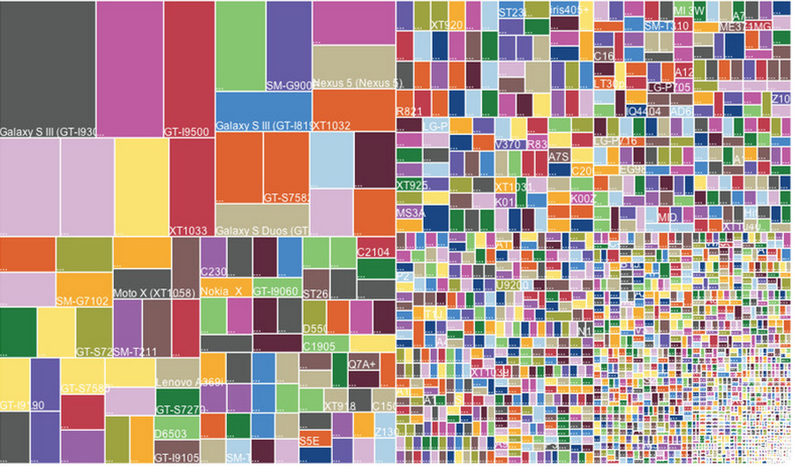
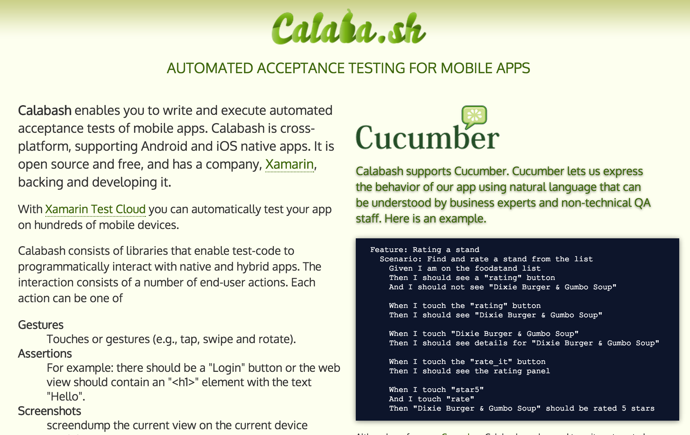

footer: Poohdish Rattanavijai (+RobGThai), 2015
slidenumbers: true


#[fit] Testing Android Application

---


# Machine Setup
- JDK (1.7+)
- Android SDK
- Android Studio
- Gradle
- Genymotion (Optional)

---


# Objectives

- Understand the need for Instrumenting Acceptance Test
- Being able to write basic instrument test for Android application
- Generating consumable and sane report
- Learning about core component of Android Testing
- Tips, Tricks, and limitations

---

# Why Automate Test?

^ Talk about the tedious testing over number of devices.

---

# 2012


---

# 2013


---

# 2014



---

# What is your scope?

^ How many device should be tested?

---

One device?


---

# What are there to test?


---

# A brief history of testing on Android

---


# Testing on Android (Dark Ages)

- Robolectric
- Robotium
- JUnit
- Android Mock

---


# Robolectric


---


# Robotium

## <<Recheck this>>


---


# JUnit


---


# Android Mock


---


# Testing on Android (Middle Ages)

- Robolectric
- Calabash
- UiAutomator
- Espresso 1.1

---


# Calabash



---


# UiAutomator


---


## Testing on Android (Golden Ages)

1. Testing Framework
1. Spoon
1. Espresso 2.0
1. Burst

---

# Begin Android Testing

---


# 1. Testing Framework

---


# Creating HelloTest

1. Create _**New Project**_ in Android Studio
2. Name it _**HelloTest**_
3. Minimum SDK 16 (Android 4.1 JB)
4. Blank Activity
5. Make some coffee while waiting


---


# Act like an expert

_Check if project can be built_

```
./gradlew build
```

_Check if device connected_

```
adb devices
```

_Install application_

```
./gradlew installDebug
```


---


# Run your first test

```
./gradlew connectedCheck
```

or use Gradle shortcuts

```
./gradlew cC
```


---


# Test report?

```
open app/build/outputs/reports/androidTests/connected/index.html
```


---


# Create your 1st test case

1. Create _**MainActivityTest**_ Class in the same directory with _**ApplicationTest**_.
2. Extends ActivityInstrumentationTestCase_**2**_

```Java
public class MainActivityTest
extends ActivityInstrumentationTestCase2<MainActivity>{

  public MainActivityTest() {
    super(MainActivity.class);
  }
}
```

---


# Create your 1st test method

```Java
public void testActivityIsAvailable() {
  assertNotNull("Activity is not available", getActivity());
}
```

Rerun the test

```
./gradlew cC
```

---

# Looks boring?

---

# Introduction to Spoon [^1]


[^1]: http://square.github.io/spoon/

---


# Spoon

> Spoon improve upon the existing instrumentation tests to make it more useful by visualizing the result.

Spoon run tests on all connected devices simultaneously as long as _**adb**_ can see it.

---


# Integrating Spoon

• Add Spoon client to project.

```
androidTestCompile 'com.squareup.spoon:spoon-client:1.1.2'
```

• Capture screenshot inside test.

```Java
Spoon.screenshot(activity, "initial_state");
```

_**That's it.**_

---


# Running Spoon

```
java -jar spoon-runner-1.1.2-jar-with-dependencies.jar
 --apk debug.apk
 --test-apk test.apk
 --sdk /usr/local/Cellar/android-sdk/23.0.2
```

---


# Open spoon report

```
open app/build/spoon/debug/index.html
```


---


# Too hard? <br/> Let's find some help

---


# Integrate Spoon-gradle-plugin

Add buildscript to the top of App's _**build.gradle**_ and apply plugin.

```Java
buildscript {
  repositories {
    jcenter()
  }
  dependencies {
    classpath 'com.stanfy.spoon:spoon-gradle-plugin:0.14.1'
  }
}

apply plugin: 'spoon'
```

---


# Using Spoon-gradle-plugin

_**spoon-gradle-plugin**_ allow Gradle to start spoon instrumentation testing.

```
./gradlew spoon
./gradlew spoon -PspoonClassName=fully.qualified.TestCase
```

_**Just like that**_  

---


# Config spoon plugin

```Java
spoon {
  // for debug output
  debug = true

  // Change report output directory
  baseOutputDir = file("$buildDir/outputs/reports/spoon/")

  // Allow specifying single test via CLI
  if (project.hasProperty('spoonClassName')) {
    className = project.spoonClassName

    if (project.hasProperty('spoonMethodName')) {
      methodName = project.spoonMethodName
    }
  }
}
```

---


# Let's "see" the report

```Java
public void testScreenshotIsWorking() {
  assertNotNull("Activity is not available", getActivity());
  Spoon.screenshot(getActivity(), "start");
}
```

Run it using Spoon Runner

```
./gradlew spoon
```

---

# Let's do some real testing

---


# Instrumentation Testing

1. Design how actual user would interact with your application.
1. Then write a script imitating those actions.
1. Validating if the outcome match the expectation.

---


# What are the Test Cases?


---


# Let's check if user see "Hello World!"

Back to _**MainActivityTest**_

```Java
public void testHelloWorldVisibleByDefault() {
  ViewGroup root = (ViewGroup) getActivity().findViewById(android.R.id.content);
  int total = root.getChildCount();

  for(int i = 0; i < total; i++) {
    View v = root.getChildAt(i);
    if(v instanceof TextView) {
      assertEquals("TextView contain Login"
      , ((TextView) v).getText().toString(), "Hello Login");
    }
  }
}
```

---


---


---

# Espresso is a _simple API_ for writing _beautiful_ UI test

---

# Let's Begin

^ - onView()
- onData()
- registerIdlingResources()
- setFailureHandler()
- closeSoftKeyboard()
- pressBack()

---


# Espresso.onView()

Use to find view inside the current hierarchy. It is to be used in conjunction with _**ViewMatcher**_ or any _**org.hamcrest.Matcher**_ implementation.

Example:

```Java
onView(withId(R.id.name_field))
onView(withText("Hello Steve!"))
```

## TBD

---


---

# That's ~~voodoo~~ Espresso

---


---


# 1. Espresso's ViewMatcher save the day.

- isDisplayed() // Match displayed view
- isEnabled() // Match enabled view
- hasSibling() // Match view with sibling
- withId // Match view with id
- Many more ...

---


# 2. Perform action on view using ... _**perform()**_

You can do all sort of stuff using _**ViewAction**_.

Click, scroll, type, swipe, hardware button, etc.

---


# 3. Check view state using ... _**check()**_

Check whether the view match the specified state.

_**ViewAssertion**_ contains **matches()** method that adapt Matcher to use when checking. ViewAssertions also contain **doesNotExist()** method for check such that.

---


---

# Let's try this

## https://code.google.com/p/android-test-kit/wiki/EspressoV2CheatSheet


---

# Give it a shot

---


# Wild CEO appeared!

## The CEO use "Where is my logo?" <br /> It's super effective.

---


# Congratulations you can now use Espresso!

---

# Recap

---

# What about ListView


---

# How?

---

# Espresso.onData()

## The ugly sister

---


# Espresso.onData()

_**onData**_ is very similar to _**onView**_ but is used to interact with data inside AdapterView. You can specify root or adapter or the view at given position.

```Java
• onChildView() • atPosition() • inRoot()
• inAdapterView() • usingAdapterViewProtocol()
• check() • perform()
```

---


# Espresso.onData()

```Java
onData(Matchers.is(LongListMatchers.withItemSize(8)))
.atPosition(0)
.perform(click());

onView(allOf(withText("7"), hasSibling(withText("item: 0"))))
.perform(click());
```

---


# Hands On with onData Spinner

---


# Hands on with ListView

---


# Hands On with Asynchronous task

registerIdlingResources

---

# Espresso recap

- onView()
- onData()
- registerIdlingResources()
- setFailureHandler()
- closeSoftKeyboard()
- pressBack()

---

# What else can it do?

- Open/Close NavigationDrawer
- Option Menu
- Contextual ActionBar
- etc.

---

# Introduction to Burst


---


# Burst
Burst is a library for testing module that required varying data to test.

**Sample Case:**

A month factory handle creation of month object from the given number of month.

i.e. 1 -> January, 2 -> February, ... , 12 -> December

---


# Standard UnitTest method

Test 1: VerifyJanuary
Test 2: VerifyFebruary
Test 3: VerifyMarch
Test 4: VerifyApril
...
Test 12: VerifyDecember

---


# Let's write that test

---

# You can use Burst in Instrumentation Test with ActivityRule

---


# Integrating Burst

## Dependencies
```
androidTestCompile 'junit:junit:4.11'
androidTestCompile 'com.squareup.spoon:spoon-client:1.1.2'
androidTestCompile ('com.android.support.test.espresso:espresso-core:2.0')
androidTestCompile ('com.android.support.test.espresso:espresso-contrib:2.0') {
  exclude group: 'com.android.support', module: 'appcompat'
  exclude group: 'com.android.support', module: 'support-v4'
  exclude module: 'recyclerview-v7'
}
androidTestCompile ('com.squareup.burst:burst-junit4:1.0.2')
```

---


# Integrating Burst

## Force Hamcrest versioning

```Java
configurations.all {
  exclude module : 'junit-dep'

  resolutionStrategy {
    force 'org.hamcrest:hamcrest-core:1.1'
    force 'org.hamcrest:hamcrest-integration:1.1'
    force 'org.hamcrest:hamcrest-library:1.1'
  }
}
```

---


# Challenge Time <br /> Let's automate <br /> Github app[^g]

[^g]: https://github.com/github/android

---

# Extras

---


# AndroidTestCase & Android UnitTest

---


# Hamcrest Matcher [^h]

Hamcrest is a framework for writing matcher objects allowing _**match rules**_ to be defined declaratively.

[^h]: https://code.google.com/p/hamcrest/wiki/Tutorial

---

# Q&A

# :beers: :wine_glass: :cocktail:

---

# Thank you


Poohdish Rattanavijai
thisisrobg@gmail.com
+RobGThai

---


# testHiEspressoIsDisplayed

create a new test to check TextView with "_**Hi Espresso**_" is displayed.

---


# testTextHelloIsDisplayed

create a new test to check TextView with id _**R.id.txtHello**_ is displayed.

---


# testTextHelloIsDisplayed

create a new test to check TextView with id _**R.id.txtHello**_ is displayed.

---

# Project setup
- espresso-core:2.0
- testing-support-lib:0.1
- espresso-contrib:2.0
- junit:4.11
